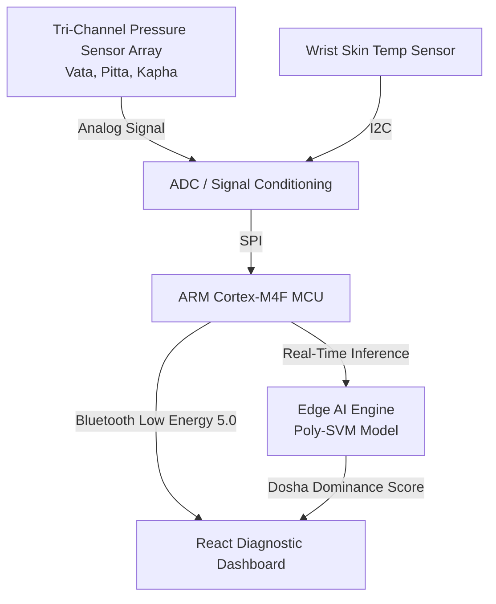

# 🩺 Nadi Pariksha Diagnostic Machine Dashboard
## 🚀 An IEEE Research Project Bridging Ayurvedic Wisdom & Modern Sensor Technology

[](https://alpha-ignite-dash-2026.web.app)
[](https://alpha-ignite-dash-2026.web.app)
[](package.json)
[](artifacts/alpha_ignite_design_skill.md)

This repository contains the interactive clinical dashboard for the **Sensor-Based Nadi Pariksha Diagnostic Machine** research project. The system captures micro-variations in radial arterial pulse pressure across Vata, Pitta, and Kapha positions, running edge-optimized AI classifiers to generate objective, repeatable, and digitally trackable wellness insights.

🔗 **Live Deployment:** [https://alpha-ignite-dash-2026.web.app](https://alpha-ignite-dash-2026.web.app)

---

## 📸 System Architecture



---

## 🎨 Design System: "Classic AI / Premium Wellness"

The project adheres to the custom design rules defined in our [Alpha Ignite Design Skill](file:///C:/Users/lenovo/.gemini/antigravity/brain/b624dd4f-4af0-44ec-94ba-6178049954cc/artifacts/alpha_ignite_design_skill.md) standard. 

### 🎨 Color Palette
- **Primary Page Background:** HSL Slate-50 (`#f1f5f9`)
- **Primary Text:** HSL Slate-900 (`#0f172a`)
- **Accent Primary:** Blue-600 (`#2563eb`)
- **Accent Secondary / Dark Surface:** Sky-600 (`#0284c7`) & Slate-900 (`#0f172a`)
- **Dosha Core Colors:** Vata (`#3b82f6` - Blue) · Pitta (`#ef4444` - Red) · Kapha (`#10b981` - Emerald)

### 🧩 UI Elements
- `card-medical`: Custom container with smooth translation and sky hover border effects.
- `btn-primary` & `btn-secondary`: Sleek buttons with active scale micro-animations.
- `glass-panel`: Border-sleek white panels with backdrop blur effects.

---

## 🗺️ Page Mapping & Navigation

| Route | Page Component | Features & Description |
|---|---|---|
| `/` | **Home Page** | Introduction to core machine capabilities, research stats (94.2% accuracy), and key objectives. |
| `/about` | **About Project** | Comprehensive scientific timeline (Phase 1-5), project objectives, and literature review references. |
| `/sensors` | **Sensors Explorer** | Interactive detail panel for Piezoelectric Vata, Piezoresistive Pitta, Capacitive Kapha, and Infrared Temp sensors. |
| `/dashboard` | **Diagnostic Dashboard** | Real-time SVG pulse waveforms (Recharts), Vital signs telemetry, AI Dosha Analysis, and report generation controls. |
| `/admin` | **Clinical Console** | Practitioner dashboard with subject records, database management, and active machine parameter configuration. |
| `/team` | **Research Team** | Profiles of the Principal Investigators, engineering teams, and IEEE advisor boards. |

---

## 🛠️ Technology Stack

- **Framework:** Vite + React 19 + TypeScript
- **Styling:** Tailwind CSS v4 + Vanilla CSS utility class configurations
- **Animations:** Framer Motion (sequential stagger on entrances)
- **Charts:** Recharts (custom dual-shaded area layouts for medical pulse waveforms)
- **Icons:** Lucide Icons (Unified set)
- **Hosting:** Firebase Hosting (fully automated CLI builds)

---

## ⚡ Development & Scripts

Ensure you have [Node.js](https://nodejs.org) installed on your system.

### 1. Installation
Install all required project dependencies:
```bash
npm install
```

### 2. Local Development Server
Start the development server with Hot Module Replacement (HMR):
```bash
npm run dev
```

### 3. Production Build
Compile and minify the React application for production deployment:
```bash
npm run build
```

### 4. Code Quality & Linting
Run the ESLint suite to verify code formatting compliance:
```bash
npm run lint
```

---

## 🌐 Deployment Configuration

The application is deployed using the default project profile mapping in [.firebaserc](file:///.firebaserc):
```json
{
  "projects": {
    "default": "alpha-ignite-dash-2026"
  }
}
```

Deploy the compiled distribution bundle directly to Firebase Hosting:
```bash
firebase deploy --only hosting
```

---

## ⚖️ Ethics & Academic Standards

This dashboard and associated research data strictly comply with **IEEE Ethics Guidelines** and **HIPAA/HCP Data Standards**. All patient pulse datasets are entirely anonymized at the MCU level prior to transmission to local client browsers.
